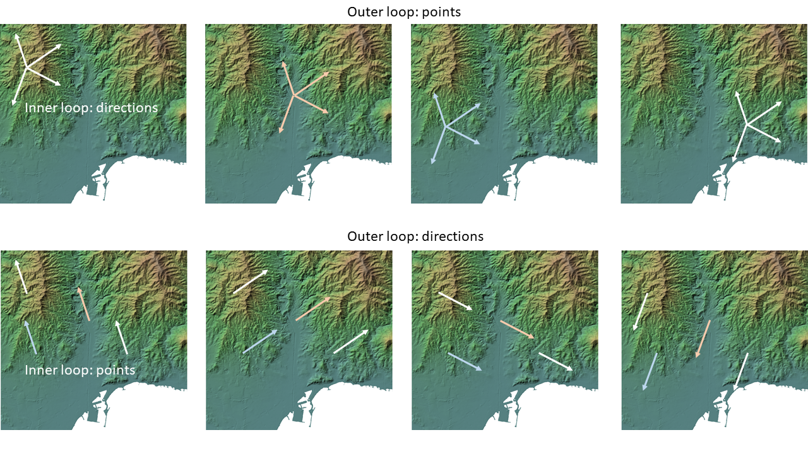
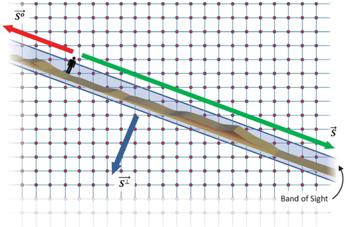
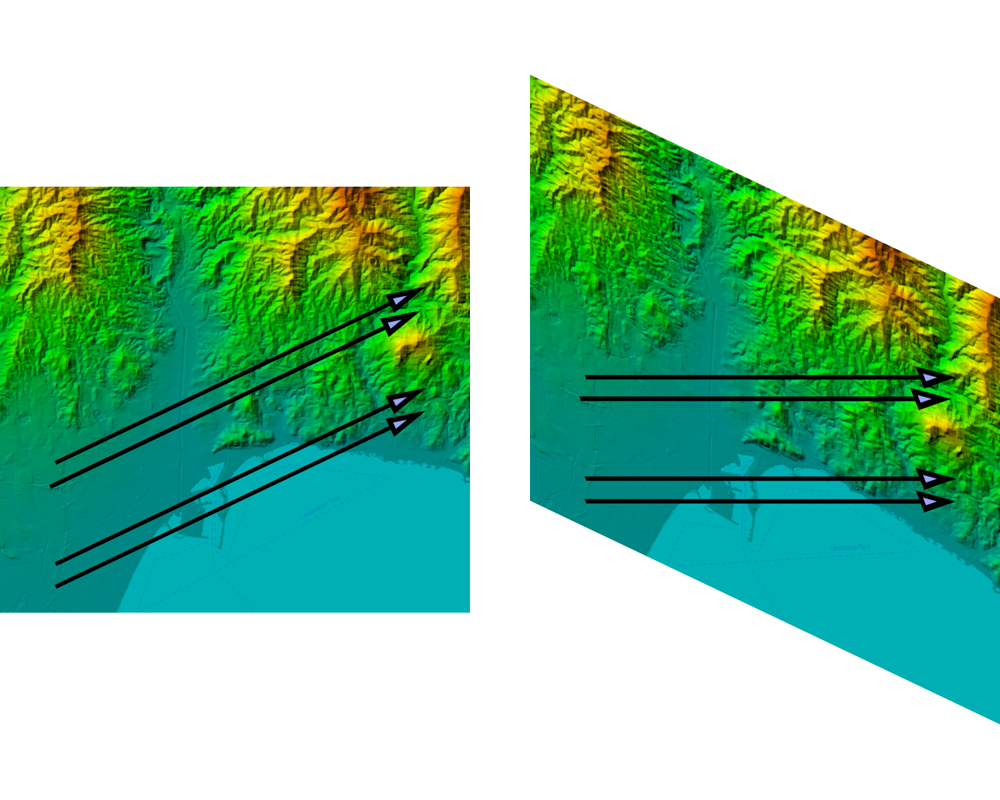
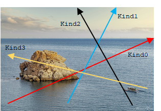
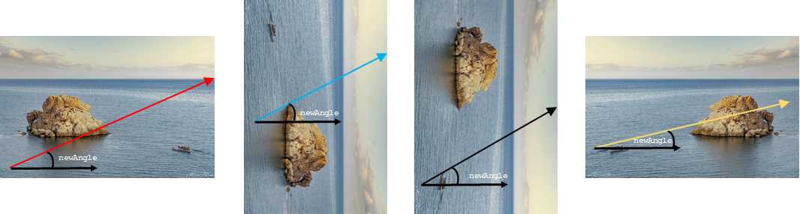
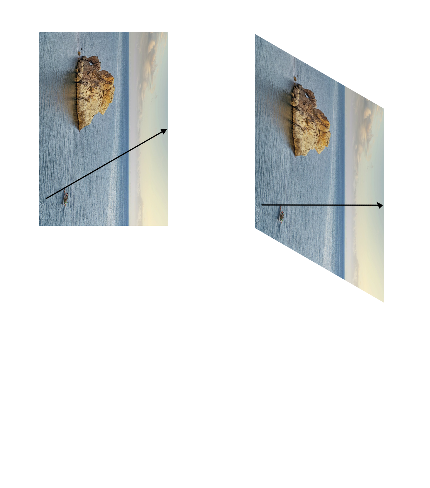
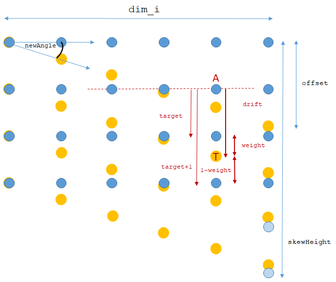
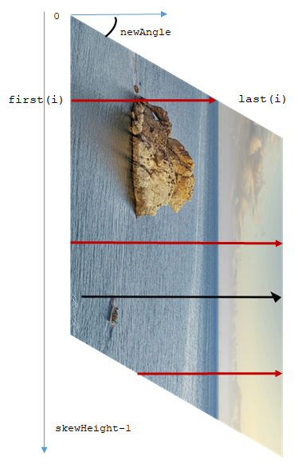
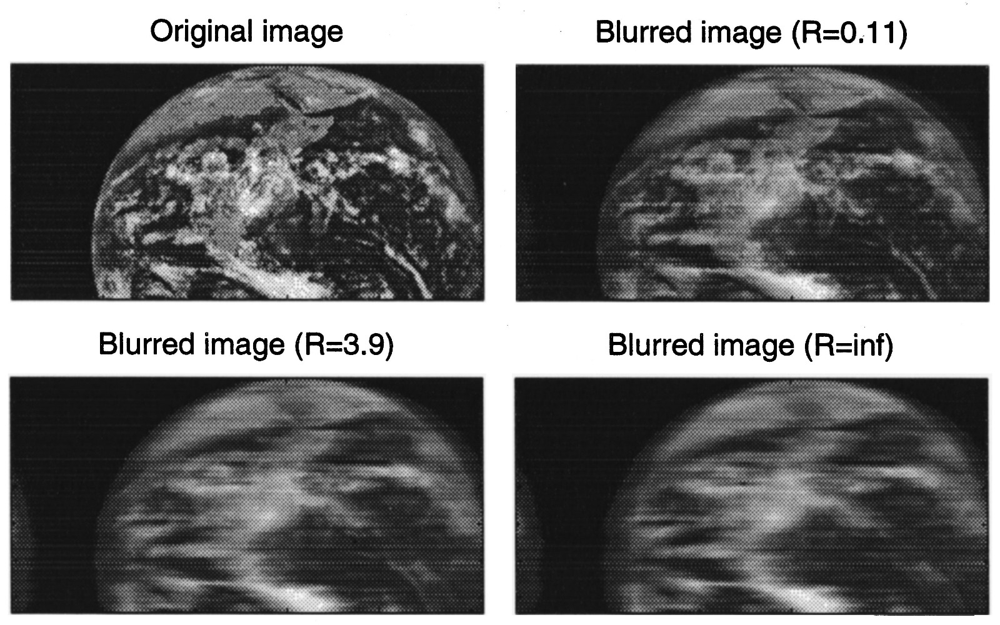

# SkewEngine
Luis Felipe Romero

Un algoritmo para el cálculo intensivo de datos bidimensionales con una fuerte dependencia radial

<br>

## Introducción

Existen problemas, en muchos y muy diversos campos, en los que es necesario realizar un cálculo extremadamente intensivo sobre cada uno de los puntos de una malla de datos 2D o 3D, como por ejemplo, sobre cada uno de los píxeles de una imagen, sobre cualquier punto de un mapa, o en los datos de una resonancia magnética. 

En algunos casos, la intensidad aritmética es tan alta, que hace que el problema sea intratable, desde el punto de vista computacional.

Veamos el ejemplo de la cuenca visual de un punto, en un modelo digital de elevaciones. Imagine que desea conocer qué parte de un territorio es visible desde un determinado lugar del territorio:

<p style=text-align:center;>

</p>

Como es obvio, para saber si desde A se puede ver B (donde B puede ser cualquier punto), habría que tener en cuenta la altura del resto de puntos, por ejemplo, C, que pueden ser un obstáculo para la visión. 

En un modelo digital (**DEM**, de *digital elevation model*), con N = dimx·dimy datos, la complejidad del problema, usando la notación big-O, sería O(N<sup>2</sup>), aunque es evidente que dicha complejidad se puede reducir si sólo se consideran como obstáculos los puntos C que están en la línea A-B. Aún así, el problema, de complejidad O(N<sup>1.5</sup>), es bastante lento. La aplicación Google Earth, por ejemplo, tarda varios segundos en obtener un resultado aproximado.


<p style=text-align:center;>

</p>

Pues bien, imagine ahora que desea averiguar el punto de un territorio que tiene "las mejores vistas posibles". En tal caso, tendría que calcular la cuenca visual desde todos los puntos de un territorio, y estaría abordando el problema conocido como ***total viewshed***, de complejidad O(N<sup>2.5</sup>).

Este sería un ejemplo de problema computacionalmente intratable (salvo para mapas con muy pocos datos y baja resolución) si no fuera porque tienen una fuerte *dependencia radial*, que hace que la información tiene mucho más valor cuanto más próxima se sitúa respecto al punto de interés (**pov**, de *point of view*). En consecuencia, para puntos alejados, no necesitamos usar toda la información, sino sólo una parte, o ninguna.

<br>

### Algoritmo de Romero, *et al*

En 2012, Romero *et al* [publican](https://www.ac.uma.es/~siham/visibility-2012.pdf) un algoritmo que considera dicha dependencia radial calculando la cuenca visual, para todos los puntos, en un conjunto discreto de direcciones (360, normalmente). Es decir, para cada sector angular de un grado, sólo tiene en cuenta los puntos en el eje central del sector.

<pre>
for pov in 1,N
    for sector in 1,360
        viewshed[pov] = function(sector,DEM)
</pre>


Además, aprovecha que todos los datos estén alineados en una dirección para reaprovechar la información en las memorias caches. Su principal aportación consiste en invertir el orden de los lazos:

<pre>
for sector in 1,360
    for pov in 1,N
        viewshed[pov] = function(sector,DEM)
</pre>

En la siguiente figura, las dos imágenes centrales de la fila interior muestran cómo, al intercambiar los lazos, se puede aprovechar para aplicar el algoritmo a todos los puntos que se encuentran alineados en la misma dirección del lazo exterior.


<p style=text-align:center;>

</p>


En particular, dado una dirección, por ejemplo, oeste-suroeste (~22º), se hace un barrido sobre todo el modelo, en dirección transversal, y se calcula la cuenca visual, sólo en esa dirección, acumulando finalmente los resultados del resto de direcciones.

<p style=text-align:center;>

</p>


En este [video](https://www.youtube.com/watch?v=Ohs8ioyYpX09) se muestra una animación del algoritmo.

<br>

### Algoritmo SDEM

Recientemente (2021), *Romero et al* [publican](https://www.tandfonline.com/doi/full/10.1080/13658816.2020.1844207) una importante modificación del algoritmo en el que se consideran dos aspectos claves para mejorar aún más el rendimiento:

* Si, dado un sector, sólo vamos a utilizar el resto de puntos que están en la misma línea ¿por qué no colocarlos directamente en la misma línea de memoria, para aprovechar la localidad espacial?

* Si, dado un sector, sólo vamos a utilizar el resto de puntos que están en la misma línea (no hay dependencia con otras líneas), ¿por qué no trabajar en paralelo con todas las líneas simultáneamente, usando además, GPUs?

Nace así el algoritmo sDEM (de skew-DEM, modelo sesgado de elevaciones), que se basa en la idea de colocar los datos en memoria de una forma apropiada para el cálculo en una determinada dirección, ya que el coste de "deconstruir y reconstruir el mapa" merece la pena, teniendo en cuenta la intensidad de los cálculos que se van a realizar sobre los datos en su estado "sesgado".

<p style=text-align:center;>

</p>

En el siguiente [video](https://youtu.be/KIL9UjuGm8U) se visualiza gráficamente el sesgado del territorio, e incluiso se estudia la posibilidad de hacer mejoras de rendimiento mediante blocking.

<br/>

---
## Propuesta

Generalizar la idea y extenderla a cualquier algoritmo, mediante una plantilla que sea independiente del algoritmo.

<br/>

---
## Elementos de una plantilla para el código

El código main debe realizar:

1. Lectura de la imagen/modelo/etc.
2. Preparación de datos que necesitaría cada GPU o cada CPU
3. Puesta en marcha de los hilos necesarios
4. Un lazo principal (iteraciones 0-179 para un grado de resolución)
    
        Las iteraciones se asignan a GPU(s) si existe(n).     
        Si no existen, a CPUs. 
        Así, cada CPU/GPU recibe varios sectores sobre los que va a trabajar.

    4.1. **Preparación de datos (skew)**

    4.2. **Procesamiento en CPU o GPU**

    4.3. **Reparación de datos (deskew)**

5. Recolección de resultados de las CPUs/GPUs

Considerando la anterior estructura, se propone el siguiente código:

<br>

```c
// Programa principal:

int main(int argc, char *argv[]) {
    configure(argc, argv);
    omp_set_num_threads(nthreads);
    execute():
    deallocate();
    return 0;
    }

// Función de cálculo

int execute() {
    inData_t inData=prepareData();
#pragma omp parallel default(shared)
    {
        ...
#pragma omp for schedule(dynamic) nowait
        for (int i = 0; i < 179; i++) {
            // ... in CPU or GPU, work
        }
#pragma omp critical
        {
            // ... reduce function
        }
        delete skewer;
    }

```


## La clase skewEngine

Se propone a continuación una clase (skewEngine) que sirva para cualquier tipo de datos (enteros, flotantes, double, o píxeles, por ejemplo) y que se encargue de todo lo relacionado con la preparación de los datos:

* Se debe crear un objeto skewEngine en cada hilo, ya sea CPU o GPU. Se hace en la etapa 3. Llamaremos *motores* a dichos objetos.

* En la etapa 4.1, el motor se encarga de "sesgar" los datos de entrada
* En la etapa 4.2, una función externa aplica un algoritmo supuestamente costoso
    * resultadoSesgado = FuncionComplicada(estradaSesgada) Por ejemplo:
        * FuncionComplicada = cuencaVisualTotal en 1D
        * FuncionComplicada = DFT en 1D
        * FuncionComplicada = Identidad (para estimar el overhead)
* En la etapa 4.3, el motor se encarga de "reparar" los resultados sesgados
* En la etapa 4, una sección crítica recupera la información de los motores, y los destruye.

```c
\\  Kernel del código:

int execute() {
    inData_t inData=prepareData();
#pragma omp parallel default(shared)
    {
        skewEngine<float> *skewer=new skewEngine<float>(dimx, dimy,inData);
#pragma omp for schedule(dynamic) nowait
        for (int i = 0; i < 179; i++) {
            skewer->skew(i);
            kernel(skewer);
            skewer->deskew();
        }
#pragma omp critical
        {
            reduce(skewer,outData);
        }
        delete skewer;
    }
```


<br/>

---
## Implementación de skewEngine

Consideremos una imagen o mapa 2D (todo es extrapolable a 3D de forma anidada) a la que queremos aplicar el algoritmo. En primer lugar, hay que considerar que:

* Los datos alineados se procesan de izquierda a derecha y viceversa, por lo que sólo se consideran 180º de trabajo.

* Los 180 sectores se clasifican en cuatro bloques, con el objeto de hacer el algoritmo más simple y eficiente. Los cuatro bloques dependen del aspect-ratio de los datos de entrada, y en particular, de la variable ``fAngle=atan(dimy/dimx)``, es decir, ``set0=[0,fAngle[, set1=[fAngle,90[, set2=[90,180-fAngle[, set3=[180-fAngle,180[``

En la siguiente imagen (fotografía de [Manuel Rueda](https://www.instagram.com/zappa_)) se muestran 4 ángulos de cada uno de los conjuntos:

<p style=text-align:center;>

</p>

Antes de proceder al sesgado, se preparan 4 versiones de la imagen o modelo de entrada, a las que podríamos llamar *Normal-Normal, Transpose-Normal, Transpose-Mirror y Normal-Mirror*, y que se corresponderán con las entradas que necesitaría el algoritmo para los ángulos de cada uno de los conjuntos de sectores:

<p style=text-align:center;>

</p>

```c
indata_t prepareData(T *input)
{
    for(int i=0;i<dimy;i++) {
    int ci=dimy-1-i;
    for (int j = 0; j < dimx; j++) {
        int cj=dimx - 1 - j;
        T val =
        input [dimx * i +  j];
        input1[dimy * j + ci] = val;
        input2[dimy *cj + ci] = val;
        input3[dimx * i + cj] = val;
        }
    }
    ... \\ return 4 array of type T
}
```


Ahora, a diferencia de los trabajos en sDEM, y gracias a la preparación de datos, el algoritmo no tiene que distinguir entre signos para la tangentes, ni tipos de acceso, ni está limitado a modelos cuadrados. El procesamiento es similar en los cuatro casos. Consiste, básicamente, en sesgar los datos de entrada, mediante un mecanismo simple de interpolación.

<p style=text-align:center;>

</p>


En concreto, será necesario calcular varios parámetros simples, como el ángulo de sesgo (```newAngle```), el desplazamiento que tendrá la última columna (```offset```), las dimensiones verticales y horizontales de la correspondiente versión de entrada (```dim_o, dim_i```) y que serán los límites de los lazos externos e interno (outer, _o, e inner, _i) que recorran los datos.

<p style=text-align:center;>

</p>

Finalmente, hay que tener en cuenta que al sesgar los datos de entrada (al pasar del rectángulo al romboide), cada elemento de entrada se va a ubicar en la misma columna, pero en un lugar intermedio entre dos filas del array destino. Por ese motivo, necesitamos calcular un par de vectores que sólo dependen del índice de columna: ```target``` y ```weight```, siendo ```target``` el nº de filas que avanza un determinado punto hacia abajo (redondeado a inferior), y ```weight``` un factor de ponderación según la ubicación entre ```target``` y ```target+1```. En la imagen anterior se representan en rojo dichos parámetros independientes de la fila.

<br/>

## Código con los cálculos previos al sesgado

```c
    isT= angle > fAngle && a < 180-fAngle;
    isM= angle > 90;
    if(!isT&&!isM){has0=true;sectorType=0;newAngle=a;}
    if( isT&&!isM){has1=true;sectorType=1;newAngle=90-a;}
    if( isT&& isM){has2=true;sectorType=2;newAngle=a-90;}
    if(!isT&& isM){has3=true;sectorType=3;newAngle=180-a;}
    dim_i=isT?dimy:dimx; //inner dimension
    dim_o=isT?dimx:dimy; //outer dimension
    dim_skewx=dim_i;
    dim_skewy=2*dim_o;
    skewness=tan(newAngle*torads);
    iskewness=1/skewness;
    offset=dim_i  * skewness;
    for (int j = 0; j < dim_i; j++) {
        double drift = skewness * j;
        target[j] = drift; //round to integer
        weight[j] = drift - target[j]; //weight is lower when drift is close to target
    }
    skewHeight=dim_o+target[dim_i-1]+1;
```

Por último, calcularemos el número de filas que se van a procesar sobre el modelo sesgado, ```skewHeight```, así como los límites de cada fila, que dependen de ```newAngle``` y ```offset```, y de ```dim_i, dim_o```

<p style=text-align:center;>

</p>


## Cálculo de los límites del modelo sesgado

```c
    for (int i = 0;i< skewHeight; i++) 
    {
        first[i]=0;
        last[i]=dim_i;
        if(i<offset)last[i]=(i+1)*iskewness+1; //excluded
        if(i>dim_o)first[i]=(i-dim_o)*iskewness+1;
    }

```

<br>

## Sesgado del modelo

Por último, se ejecuta el sesgado del modelo

```c
    for(int i=0;i<=skewHeight*dim_i;i++)
        skewInput[i]=skewOutput[i]=0;

    T *source=isT?(isM?input2:input1):(isM?input3:input0);

    for (int i = 0; i < dim_o; i++) {
        for (int j = 0; j < dim_i; j++) {
            int row = i + target[j];
            skewInput[row * dim_i + j] += (1.0 - weight[j]) * source[dim_i * i + j];
            skewInput[(row + 1) * dim_i + j] += weight[j] * source[dim_i * i + j];
        }


```


<br/>

## Computación intensiva tras el sesgado

Una vez preparado los datos, el algoritmo intensivo es un simple bucle, que se puede ejecutar con paralelismo anidado:

```c
for(int i=0;i<skewHeight;i++>)
    outputSkewed[i]=kernel(inputSkewed[i],first[i],last[i]);
```

Es importante no olvidar que el espacio se ha deformado, por lo que las distancias que se apliquen en el algoritmo (si se necesitan) tienen un factor de escala ```1``` en vertical y ```1/cos(newAngle)``` en horizontal.

## Reconstrucción de los datos no sesgados:

El proceso de interpolación de los resultados es mucho más simple, ya que no es necesario computar nuevos parámetros. Para ello, definimos un método para el "enderezado": 

```c
skewEngine::deskew()
{
    T *output;
    if(sectorType==0)output=output0;
    if(sectorType==1)output=output1;
    if(sectorType==2)output=output2;
    if(sectorType==3)output=output3;
    for(int i=0;i<dim_o;i++)
        for(int j=0;j<dim_i;j++)
            output[i*dim_i+j]+=
                    (1-weight[j])*skewOutput[(i+target[j])*dim_i+j]+
                    weight[j]*skewOutput[(i+target[j]+1)*dim_i+j];
}
```

## Reducción

Cuando una CPU o GPU termina de procesar los sectores que le han sido asignado, tiene que pasar a la fase crítica de reducción. El correspondiente thread puede tener datos de sectores asignados a más de un tipo de los 4 conjuntos, por lo que se apoya en cuatro variables booleanas. En este momento, los datos traspuestos o en espejo recuperan la ubicación original:

```c
#pragma omp critical
    {
    for (int i = 0; i < dimy; i++){
        int ci=dimy-1-i;
        for (int j = 0; j < dimx; j++) {
            int cj=dimx-1-j;
            if (skewer->has0)outData[i][j] += skewer->output0[i * dimx + j];
            if (skewer->has1)outData[i][j] += skewer->output1[j * dimy +ci];
            if (skewer->has2)outData[i][j] += skewer->output2[cj* dimy +ci];
            if (skewer->has3)outData[i][j] += skewer->output3[i * dimx +cj];
        }
    }
    }

```


El archivo [skewEngine.MD](skewEngine.MD) muestra cómo quedaría la clase skewEngine.

<br>

---
## Caso de estudio: Motion blurring

Detección de coeficientes de movimiento en imágenes borrosas por movimiento. El objetivo es reconstruir la imagen.

La velocidad y la dirección son los coeficientes que se necesitan

<p style=text-align:center;>
 
</p>

Dichos coeficientes son diferentes en distintas partes de la imagen

<p style=text-align:center;>
 
</p>

Creo que en cada punto de la imagen y en cada dirección hay que hacer una DFT para averiguar si hay movimiento en dicha dirección y en qué cantidad.

## Próximos pasos

Buscar dos imágenes con parte borrosa total y por zonas y pasarla a mapa de píxeles grises.

Hay bases de datos con imágenes borrosas
como la del autobús, con más resolución, p.e.

La gente usa una que se llama cameraman

Creo que hay que calcular el cepstrum de una imagen

[Este paper me parece claro](https://www.mdpi.com/1424-8220/22/4/1635/htm#B23-sensors-22-01635)

[Este tiene una imagen que explica como obtener PSF del cepstrum](https://www.researchgate.net/publication/239443817_Blind_Image_Deconvolution_Motion_Blur_Estimation)


Meter el código del cepstrum. Lo hay en Python en github

Creo que necesitaría un parámetro de radio de búsqueda en la dft  (ventana Hamming?)

Leer libro computer graphics

Hay mucho de analisis cepstral en sonido

Ir pensando en 3D y sobre todo en el reto del SKA


